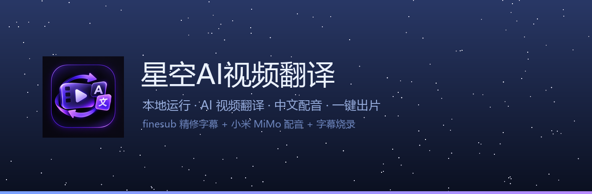
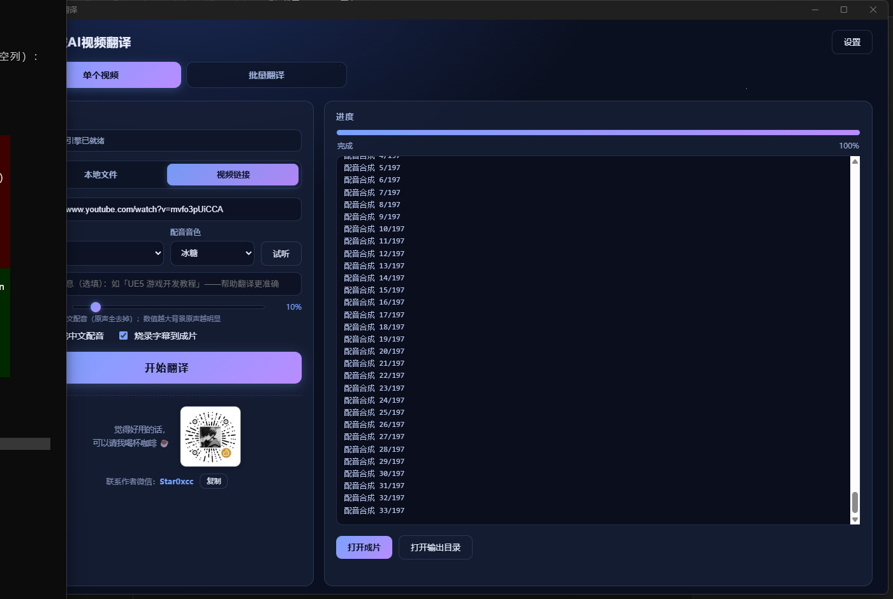

<div align="center">
  
</div>

<h1 align="center">星空AI视频翻译 · StarryVT</h1>

<p align="center">
  <b>本地运行的 AI 视频翻译工具</b><br>
  视频 → 中文翻译 → 中文配音 → 带字幕成片，一个窗口搞定
</p>

<p align="center">
  
  
  
  
</p>

<p align="center">
  <a href="../../releases/latest"><b>⬇️ 下载最新版</b></a> ·
  <a href="#-快速开始">快速开始</a> ·
  <a href="#-常见问题">常见问题</a>
</p>

---

## 📖 这是什么

一个**在你自己的电脑上跑**的视频翻译工具。粘贴一个 YouTube 链接（或选本地视频），它会：

**①** 识别语音 → **②** AI 精修并翻译成中文 → **③** 用 AI 音色配中文音轨 → **④** 合成带字幕的成片

全程本地计算，视频内容不上传到任何服务器；AI 服务（翻译 / 配音）由你**自己申请 API Key**，按量计费透明可控。

## 🖥️ 界面预览

<div align="center">
  
</div>

## ✨ 功能

- 🎬 **视频翻译** —— 粘贴 YouTube 链接或选择本地文件，输出带中文字幕的成片
- 🎙️ **AI 配音** —— 小米 MiMo TTS，**9 种音色**（冰糖 / 茉莉 / 苏打 / 白桦 / Mia / Chloe / Milo / Dean），支持**一键试听**
- 📝 **精修字幕** —— finesub 引擎：人声分离 → 双模型语音识别 → LLM 纠错翻译
- 📦 **批量翻译** —— 整个**文件夹**或 YouTube **合集**一键批量，逐条进度可见，单条失败不影响整批
- 🖼️ **封面下载** —— 链接输入时自动保存视频封面
- 🎚️ **原声可调** —— 原声音量滑杆，拉到 **0% = 纯中文配音**（一点原声都不留）
- 🧰 **一键装引擎** —— 自动安装 uv + finesub，**无需懂命令行**
- 🔄 **自动更新** —— 启动自动检查新版本，一键静默升级
- 🩺 **诊断日志** —— 崩溃/错误自动落盘，一键导出报告（不含密钥）

## 🚀 快速开始

**① 下载安装**
到 [Releases](../../releases/latest) 下载 `StarryVT-Setup.exe`，双击安装。
> 免管理员权限；想卸载时，安装目录会被完整清理。

**② 安装翻译引擎**
打开软件，顶部若显示「未检测到翻译引擎」→ 点 **【一键安装】**。

**③ 填写 API Key**
右上角 **【设置】** → 每一栏都有「去申请 ↗」按钮和「**测试**」按钮（点一下就知道通没通）。

**④ 开始翻译**
选视频 / 贴链接 → 点 **【开始翻译】**。
> 首次会自动下载 AI 模型（约 8.5GB，有进度显示），之后永久复用。

## 🔑 准备工作

| 项目 | 要求 |
|:--|:--|
| 系统 | Windows 10 / 11 x64（WebView2 系统自带） |
| 显卡 | 建议 NVIDIA RTX 20 系以上、显存 ≥4GB（纯 CPU 也能跑，较慢） |
| 磁盘 | ≥15 GB（模型 + 运行时 + 输出） |
| **MiMo API Key** | 配音用 · <https://platform.xiaomimimo.com/console/api-keys> |
| **DeepSeek API Key** | **翻译主力（必填）** · <https://platform.deepseek.com/api_keys> |
| Gemini API Key | *选填增强*：联网查证 / 视频语境纠错 · <https://aistudio.google.com/apikey> |
| 网络代理 | 访问 YouTube / Google 时需要（填本机代理地址，如 `http://127.0.0.1:7897`） |

## 🌏 支持的语言

| 源语言 | 目标语言 |
|:--|:--|
| 英语 / 日语 / 韩语 / 俄语 / **中文** | 中文（固定） |

> 💡 源语言选「**中文**」= **换音色重配**：把你自己的中文语音，用所选音色（如冰糖）重新朗读。

## 📁 输出结构

**单个视频** —— 每个视频一个文件夹（链接输入时会保留原片）：

```
output/<视频名>-<日期时间>/
├── 原始视频.mp4          下载的原片（本地文件输入时无此项）
├── 封面.jpg              视频封面
├── <视频名>.srt          中文字幕
├── <视频名>_dubbed.mp4   配音版（无字幕）
└── <视频名>_final.mp4    ⭐ 成片（中文配音 + 字幕烧录）
```

**批量翻译** —— 一次批量 = 一个父文件夹，每个视频一个子文件夹：

```
output/批量-<日期时间>/
├── 视频A/
│   ├── 原始视频.mp4   封面.jpg   视频A.srt   视频A_final.mp4
├── 视频B/
│   └── …
└── …
```

<details>
<summary><b>那个 tts_cache 文件夹是什么？</b></summary>

AI 配音的逐句音频缓存。**重跑同一个视频时会秒级复用**，不用重新合成配音；确认成片没问题后可以删掉。
</details>

## ❓ 常见问题

<details>
<summary><b>首次为什么要下载 8.5GB？</b></summary>

那是翻译引擎的运行时 + 三个 AI 模型：

- **Whisper large-v3-turbo**（语音识别主力）
- **Qwen3-ASR 0.6B**（交叉校验，减少错字）
- **BS-Roformer**（人声分离，让有背景音乐的视频也能识别准）

下载一次永久复用，**重装软件也不用重下**。
</details>

<details>
<summary><b>🎯 没有代理 / 梯子，能用吗？</b></summary>

**能，但功能有所取舍**：

| 功能 | 没有代理 |
|:--|:--|
| 翻译（DeepSeek） | ✅ 可以（国内直连） |
| 配音（MiMo） | ✅ 可以（国内直连） |
| 语音识别 / 字幕 / 烧录 | ✅ 可以（全部本地） |
| 下载 YouTube 链接 | ❌ 不行 |
| 视频语境纠错 / 联网查证 | ❌ 不行（要访问 Google） |

**没代理的正确用法**：输入选「本地文件」，关掉设置里的两个 Gemini 增强，其余照常用。
</details>

<details>
<summary><b>必须开代理吗？</b></summary>

**翻译和下载需要**（要访问 Google / YouTube）；语音识别、配音、字幕烧录**全部在本机完成**，不需要代理。
</details>

<details>
<summary><b>可以只要字幕，不要配音吗？</b></summary>

可以。主页有「生成中文配音」「烧录字幕」两个开关，按需勾选。
</details>

<details>
<summary><b>背景原声怎么处理？</b></summary>

主页的「**原声音量**」滑杆控制：`0%` = 纯中文（一点点原声都没有）；`15%`（默认）会保留一点背景音，音乐/音效不丢。
</details>

<details>
<summary><b>翻译准确吗？</b></summary>

由 AI 自动生成，**可能存在错误，请务必自行核对后再使用**（详见[使用条款](TERMS.md)）。专业术语较多的内容，可以在主页「背景信息」里填一句主题（如“UE5 游戏开发教程”），能明显改善术语译法。
</details>

<details>
<summary><b>出错了怎么办？</b></summary>

【设置】→【导出诊断报告】，把生成的 zip 发给作者即可。软件会自动记录完整堆栈与环境信息（**不含你的 API Key**）。
</details>

<details>
<summary><b>会收集我的视频/数据吗？</b></summary>

不会。所有处理都在你本机；软件只按你的配置调用第三方 AI 接口（翻译/配音），不经过作者的服务器。
</details>

## 📄 许可与声明

- 本软件为**闭源软件**；打包内置的第三方开源组件（pywebview / pythonnet 等，均为宽松许可）见 [THIRD_PARTY_LICENSES.md](THIRD_PARTY_LICENSES.md)
- 使用条款见 [TERMS.md](TERMS.md) —— **AI 生成结果仅供参考，请自行核对**
- 翻译引擎 [finesub](https://github.com/caca2331/finesub)（GPL-3.0）由用户自行安装，**本软件不打包、不分发**

## 💬 联系作者

反馈问题、提建议、定制需求都欢迎 👉 **微信：Star0xcc**

<div align="center">
  
  <br>
  <sub>如果这个工具帮到了你，欢迎请作者喝杯咖啡 ☕</sub>
</div>

---

<p align="center"><sub>Made with ❤️ by Ker0el · Powered by <a href="https://github.com/caca2331/finesub">finesub</a> & 小米 MiMo</sub></p>
